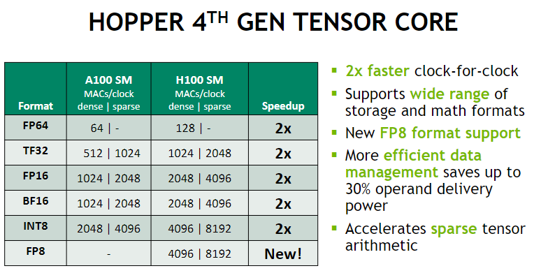
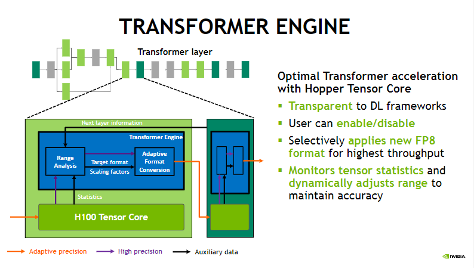
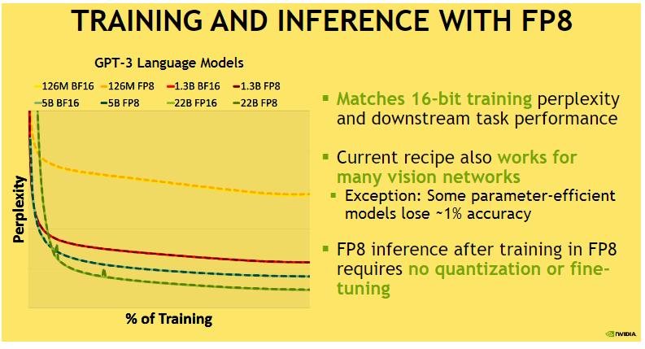

# FP8 H100 

Nvidia 发布的最新一代H100 TensorCore中引入了一种新的浮点类型FP8.相比较于FP16/BF16, FP8能得到throuput和bandwidth上得到2x的性能提升, 能得到4096 MAC/cycle.

无独有偶，2021年10月，Tesla披露了关于Dojo的一些细节。 其中最引人关注的是[Dojo White Paper](https://tesla-cdn.thron.com/static/SBY4B9_tesla-dojo-technology_OPNZ0M.pdf?xseo=&response-content-disposition=inline%3Bfilename%3D%22tesla-dojo-technology.pdf%22)
提到的一种新的可配置的浮点格式：CFloat8。

这和H100中的FP8的推出，进一步将FP8推到了更广阔的应用。

## FP8的优势

INT8/UINT8虽然在模型inference上取得了广泛的应用，但是在training的场景里边，遇到了很大的挑战：反复的Quantize和Dequantize会拖累INT8计算的带来的好处，有些情况下得不偿失。即使在
Inference阶段，一般需要一个Post-training quantization的步骤将FP32的模型量化成8-BIT。Post-training quantization需要一些validation 数据集来做calibration，确定acitvation的范围。对于大多数网络而言，量化到8-bit并不会带来明显的accuracy drop。但是并不符合 Build-once-deploy-to-all的原则。

FP8相对于INT8来说，可能更”统一“，并不需要对于模型做任何的改变，硬件的行为也更容易能够统一。 FP8 如果能够和INT8一样的效率，那么其前景也是非常广阔。

* FP8 是一个浮点，FP8 MAC的设计电路能和FP16的某种程度上重用，这样能在电路面积上带来的开销相对来说会划算一些。
* FP8 到 FP16/FP32/BF16 这样的转换电路，可以设计得更简单直接，而不需要像INT8/UINT8到FP的转化乘法和加法的开销，来达到Quantize和Dequantize的目的。
* FP8 的模型在部署时并不需要对于训练的模型做任何的修改，Build-once-deploy-to-all的原则。
* FP8 更好的规范硬件的行为。
  
## FP8的提出

2019 NIPS， 论文[HFP8](https://proceedings.neurips.cc/paper/2019/file/65fc9fb4897a89789352e211ca2d398f-Paper.pdf )中，模型inference的时候，FP8(1-4-3)在mobilenet和transformer任务上明显的精度降低。对于training来说，遇到的挑战进一步增大，weight/gradients/activation的范围相差更大，没有办法选择一个合适的格式来满足所有数值的要求。

[HFP8](https://proceedings.neurips.cc/paper/2019/file/65fc9fb4897a89789352e211ca2d398f-Paper.pdf )就提出了一种Hybrid的方式: forward的时候用 FP-1-4-3, backward的时候用 FP-1-5-2. forward的时候，更关注精度，backward的时候更注重范围。这样的话，HFP8就能够在训练的过程中获得接近FP32的表现。

## BF8 and Tesla CFloat

在工业界[Tesla DoJo](https://tesla-cdn.thron.com/static/SBY4B9_tesla-dojo-technology_OPNZ0M.pdf?xseo=&response-content-disposition=inline%3Bfilename%3D%22tesla-dojo-technology.pdf%22) 提出了一种可配置的CFloat，exponent和mantissa的位数可以动态的调整，只要满足总共的bit数就可以了。 这样，由软件来选择合适的浮点类型
CFormat，来最大化的利用硬件的性能。在white paper里边，重点提到了CFloat8和CFloat16这两类format。

下图就介绍了CFloat8_1_4_3 和 CFloat8_1_5_2的具体格式。

## FP8@H100 
H100 TensorCore中引入了新的Format: FP8. 相较于FP16/BF16, 能得到2x的性能提升，和INT8的性能相当，并且支持Sparse的加速。

FP8在H100上的支持，无疑对于其大规模应用，迈出了坚实的一步。H100的标杆作用会吸引更多的硬件来支持FP8, 进一步推动FP8的落地。

H100支持两种格式的FP8, FP8(1-4-3) 和 FP8(1-5-2)，分别对应于不同的 Exponent 和 Mantissa 的比特数。两者所能表示的数值范围不同，比如 FP8(1-4-3) 多用于来表示 weights 和 activation，而 FP8(1-5-2) 来表示gradients。

H100中的累加器accumulator的精度可保持在FP16或者FP32上，经过bias和激活函数之后，再转换成希望得到的浮点类型，如FP8/FP16/BF16/FP32，输出给下一层。支持多种FP类型的输出，提供了
极大的灵活性。这样，上层软件 runtime、compiler就能够根据网络精度的要求，来灵活的选择哪些block可以运行在FP8，哪些对精度影响较大的block运行在FP16上面。

在软件算法层面上，FP8可用来加速Transfromer结构网络的训练。Nvidia公布的算法，能够自动监测数据的range，来决定最佳的FP8格式，在速度和精度上取得平衡。这里边可以做到对于DL framework来透明。

公开的文档里边对于GPT-3做了对比，基本上可以和

