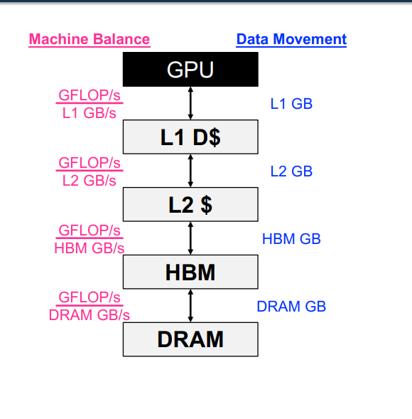
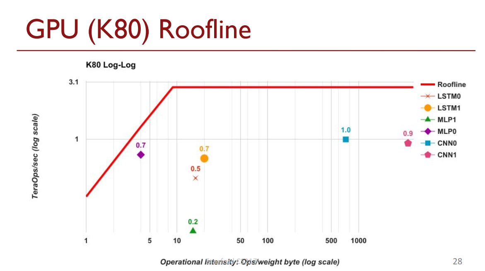

# DNN Accelerator Performance Simulation

## 为什么要对AI芯片在特定应用场景进行性能仿真
AI芯片性能比较常用指标一般都可归结于PPA(Power-Performance-Area)， Power：功耗，Performance：Tops/GFlops， Area：芯片面积。 随着AI芯片的
发展，大家逐渐的从关注从这些笼统的PPA指标过渡到更精细的指标: 比如对于某一个model的inference的throughput，一个模型能在多长的时间
之内训练后达到收敛，等等。这也是基准测试如[MLPERF](https://mlcommons.org/en/)越来越得到业界的认可的原因。

那这种转变也使得AI芯片的设计，不但要从peak performance的考虑，也要关注如何提升重要workload运行的效率。
影响Workload在芯片上的运行效率的因素有很多
* 来自Workload，比如MobilenetV2这样的简约模型，计算密集度较低，很多 depth conv layer都是memory bound。那么运行MobilenetV2，在一个计算能力很强，但是带宽受限的硬件上，整体效率并不会太高。
  如果大家关注[MLPERF](https://mlcommons.org/en/inference-datacenter-11/)的提交结果，涵盖了如BERT, Resent50，3D-UNET, DLRM等主流模型，很少有厂商会提供所有模型的结果。目前Nvidia GPU应该是提交中cover模型最多的，充分证明了GPU强大的适用性。
  技术上来说，想在不同类型模型上都取得好的名次，是非常挑战的，不仅需要非常多的工程优化，而且硬件的设计要综合考量这些因素。
* 来自软件的overhead，AI软件stack，一般包括了Compiler，runtime，firmware等模块，这些模块的效率都将影响应用的最终性能。以Compiler来说，它需要尽可能的将模型转换成硬件友好的low level graph，并尽可能的利用硬件的能力。但是这里遇到的挑战也是非常多。 关于AI graph compiler大家可以去关注[TVM]()和[MLIR](https://mlir.llvm.org/)相关的技术讨论。
* 来自硬件的设计落后于应用、算法的迭代。深度学习的算法在持续的高速的进化，从早期的GoogleNet，Resnet，再到最近的Vision Transformer的网络结构，
  可能导致硬件在设计的阶段，是能高效支持主流的模型，但是，当其推上市场的时候，如果大部分应用已经进化到新的模型结构时，那未必能很好适配新的硬件。
  这部分没法被应用高效利用的现象，有一个称号：dark silicion。

通俗一点来说，秋名山说不定更适合五菱宏光

## Roofline Modeling

AI芯片的raw peformance是非常容易计算的。相对来说，对AI芯片针对某个应用而做的**定量性能**分析要更挑战一些。一种相对简单但非常使用的方法就是Roofline Modeling。

Roofline模型, 是一种面向throughput的一种性能模型，代表的是某个应用在硬件平台**算力**和**带宽**这两个指标约束下所能达到的理论性能上界。 这篇文章的大多数内容来自
[Roofline and TPU Performance](https://cs217.stanford.edu/)和[Roofline Performance Modeling for HPC and Deep Learning Applications](https://crd.lbl.gov/assets/Uploads/S21565-Roofline-1-Intro.pdf)这两篇paper。有兴趣的话，大家可以进一步精读里边的内容。这里，我们对Roofline Modeling做一个简单的介绍。

* 图的Y轴为 可达到的Flop/s = Min（peak Flops， Arithmetic Intensity * peak bandwidth）
* 图的X轴为 计算的密集度（Arithmetic Intensity) Flops/Bytes, 这个值越高，代表运算的需求越高。

AI芯片一般都拥有多个层级的内存系统（Memory Hierarchical), 从最外围的DDR到最靠近计算单元的Cache，Memory的bandwidth也是逐层提升的。 如GPU的 DDR -> HBM -> L1 Cache -> L2 Cache

对于每一个层级，其计算密集度和带宽都是不一样的。所以，系统整体的性能是由其**短板**所决定的，如下图所示。

不同的网络每一层的计算密集度是不一样的，VGG这些经典模型的计算的密集度很高，能充分利用GPU的性能；而一些精简模型，类似于MobilenetV2，计算密集度则较低。下面则是比较了一系列的模型在TPU和GPU(K80)上的roofline，可以看到TPU相较于K80的优势。 这里边涵盖了一些典型的网络结构，如 MLP(一堆Full Connected Layer组成)，CNN 和LSTM. 从下图中，可以看到TPU"屋顶"是要远高于K80。

## Roofline Modeling中的假设

Roofline 抽象了绝大多数硬件的实现细节，导致大家对于Roofline性能分析所定义出来的KPI是存在怀疑的。尤其是当硬件流片之后，发现实测性能和Roofline所预测的性能，相差甚远的时候，大家对于KPI的怀疑程度会进一步加大。所以我们这里重申一下Roofline Modeling这里边的假设
* 计算和存储通信的完美重叠。 这里边通信时间指的是数据存储的read和write时间。一般的pipeline是 read input -> compute -> write output -> next layer read input -> next layer compute -> ..
  在roofline里边的模型假设中，数据的通信和计算是完美重叠的，由其最大的时间来决定的 t = max(compute, communication). 那这种完美的重叠是可以做到的吗？理论上是可以通过**prefetch**的方式来做到，
  在运行在layer 0 的时候，我们可以提前去load 下一个layer 1 所需要的weight，等 layer 0 执行之后，layer 1 可以立即执行。但prefetch也会带来一些副作用，比如cache面临了更大的压力。
* Memory bandwidth是恒定的，而且永远是可以保持在理论上界的。

## Roofline Modeling 在实践中的价值。

* Roofline 抽象化了硬件的实现细节，将硬件抽象成了**计算**和**存储**两个部分，隐藏了硬件和软件按的绝大多数实现细节。
  通过这样的简化，极大的提升了（>100x) 的performance simulation的效率。这样的性能仿真在芯片初期的设计是至关重要的，这也是芯片实现阶段所努力要去达到的目标。
* Roofling 能够给出初步的性能上界，能够分析出硬件的bottleneck是来自**计算**或**存储**，这也给下一代产品的设计带来了一些启示。
* 利用Roofline Modeling，我们通过比较当前产品所达到的性能和理论上限的比较，来得知还有多少可优化的空间。比如：算法的设计，优化的进度等。

