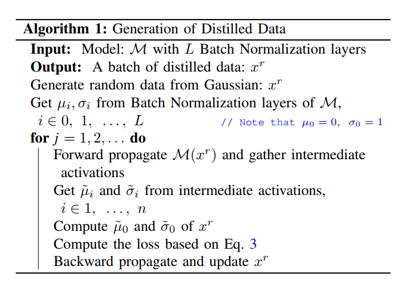
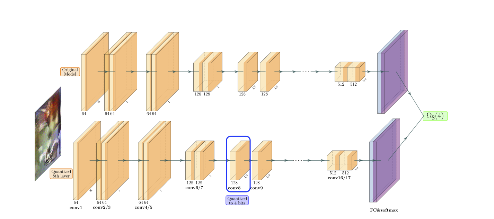
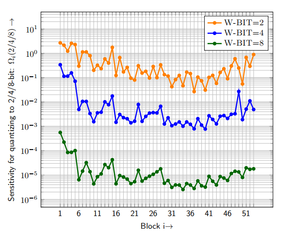
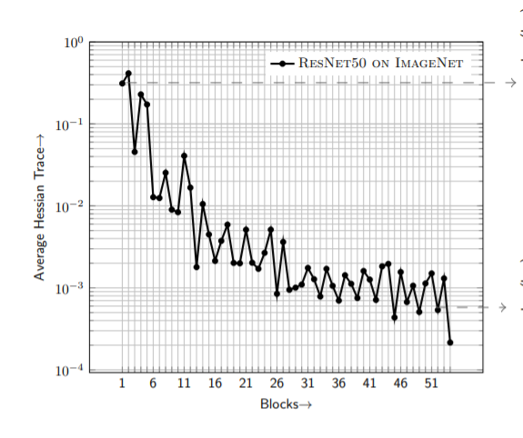

# ZeroQ: A Novel Zero Shot Quantization Framework

## 标题
* Title: ZeroQ: A Novel Zero Shot Quantization Framework
* Authors: Yaohui Cai, Zhewei Yao, Zhen Dong, Amir Gholami, Michael W. Mahoney, Kurt Keutzer
* Link https://arxiv.org/abs/2001.00281
* Code Repo: [ZeroQ](https://github.com/amirgholami/ZeroQ)
* Key words: Quantization, Mixed Precision Quantization,

## 问题介绍

通常大家遇到的量化都是全网络统一的量化bit，如activation和weights都是8-bit。这样确实对于AI芯片的设计和backend的软件来说，更友好一些。
但在某些场景中，客户并不能接受单一bit量化带来的accuracy的drop。比如，你收到一个模型，一顿操作之后，将模型量化到8-bit，accuracy相比原始模型下降了1%
但是，客户并不满意，希望能够将accuracy drop控制在0.1%以内。 例如mlperf就对量化模型的精度有着严格的要求[discussion](https://github.com/mlcommons/inference_policies/issues/13).
当你将多数layer保持在全精度的时候，这个模型的accuracy的问题解决了，可是客户又会问：inference的速度能不能更快一点？


那这个时候，mixed quantization技术就有用武之地了。比如说，在mixed quantization中，我们可以选择一些layer量化到8-bit，其余的layer保持在原来的精度上。又或者，
大多数layer量化到8-bit，少部分的量化到4-bit，从而达到最佳的inference和accuracy的平衡。

ZeroQ是一篇来自CVPR2020的文章，试图去解决 Mixed Quantization中遇到的两个痛点
* 缺少数据（train和val）。通常厂家实际部署的模型及数据涉及到IP，并不会share给第三方。极端情况下，你可能只有10几张sample。如此可怜的数据会让许多post-training quantization的方法无所适从。
* 如何给模型中每一层分配最佳的量化bit。我们知道，一个网络中每一层对于整体精度的贡献和量化误差的敏感程度是不一样的。
ZeroQ中定义了一个quantization sensitivity的指标，通过这个指标的计算，对于那些比较敏感的layer，那么会分配大的bit；而对于那些不敏感的layer，我们
则会分配小的bit。通过这样的分配策略，试图在保证同样的压缩率的情况下，取得尽量高的模型精度。


## 正文

### 如何生成合格的val数据

大家可以思考一下，如果给你一个模型，但是不给你任何输入数据，你会如何去“生成”合适的数据。 这是一个开放的问题和值得研究的问题。


ZeroQ将这部分数据称之为"Distilled Data". 为什么称之为"Distilled Data"呢？ ZeroQ实质上是利用了Knowledge Distillation的思想来“训练”这个数据。
这个听起来有点**不按常理**。我们只听过训练模型的参数，很少听过训练数据的。

ZeroQ利用了网络中batch normalization layer的统计信息: mean 和 std deviation。 BN是在网路训练的过程中，通过moving average的方式来更新mean和deviation。
在一个收敛的网络中，我们认为每一层的输出的统计值在很大程度上也是符合BN的统计信息。如果，我们有一个输入x，导致的输出统计值和BN是非常match的话，那我们认为这个输入x
和training数据是非常相似的。同样，如果统计值的偏差非常大，我们则会认为它和training数据有较大的偏差。

ZeroQ中利用这个特性，通过反向传播的方法来解决数据产生的问题。在这里，模型的weights是fixed的，将输入input作为可train的参数，通过优化下面的目标来训练
得到distilled data。下面的公式中展示了L2作为loss来训练输入。


具体的DistilledData产生步骤如下

```commandline
1. 首先产生随机的满足高斯分布的数据
2. 做一次forward()，得到每一个BN层的输入activation
3. 计算BN层输入数据的统计值，mean和deviation
4. 计算loss，
5. Backward做反向传播
```

### 如何分配量化bit

在决定每一层的bit分配之前，我们尝试去计算每一层对于quantization的敏感度sensitivity。这个metric的设计是非常有意义的。如果我们知道某些层对于quantization
更敏感一些，我们就可以给它分配更多的bit，如8-bit；反之，我们可以分配低bit给它，如 4-bit 或者 2-bit。


在同作者的另一篇文章中[HAWQ](https://arxiv.org/pdf/1905.03696.pdf), HAWQ利用Hessian trace来表征layer的quantization sensitivity。但是
这种方法是在quantization-aware training的场景中使用的，需要计算模型参数的二阶导矩阵，并不能够直接照搬到post-training quantization上。

ZeroQ中则提出了另外一个方法来计算quantization的sensitivity，主要是利用了knowledge distillation的思想。

Knowledge Distillation本身来说，是一个在网络训练和quantization经常被使用的一个技术，来自于Hinton老爷子的
[Distilling the Knowledge in a Neural Network](https://arxiv.org/abs/1503.02531).  核心思想是利用
一个teacher network来辅助来训练一个弱化或者小参数的student模型。在这里，teacher network就是你拿到的原始的full precision模型，
而student network就是那个需要帮忙的量化模型。我们的目的是希望量化模型和full precision模型的inference结果尽量的一致。

ZeroQ的算法的大致结构如下图所示



1. 上面的block为原始的full precision模型，作为teacher network。 下面的block为量化的模型，作为student network。
2. 每一次我们量化其中的一层，如conv8，量化到4-bit，那么同样的输入，teacher network 和 student network 输出会有不同。
这个不同就来自于student中conv8的量化导致的。 ZeroQ中计算二者之间的KL来作为量化的sensitivity。

利用ZeroQ的方法，我们得出了Resnet50在imagenet上的每层的sensitivity。


大家可以对比一下利用HAWQ的方法得到的Resnet50的sensitivity,来自论文[HAWQ_V2](https://arxiv.org/pdf/1911.03852.pdf)


这里边需要注意是的，这是两篇文章，虽然使用的都是Resnet50，但未必是同一个模型。通过对比，我们应该还是能得到一些启示
处于网络前端的layers，对于quantization都更敏感一些。 这也能解释，很多文章在做量化的时候，第一层经常不做量化，保持了原有的精度。


### Show Me the Code
ZeroQ的代码在其官方实现repo里边https://github.com/amirgholami/ZeroQ， 代码结构和多个例子完全展示了如何使用，
代码结构简单明了，有很多大家可以学习和借鉴的地方，大家多多去star吧。不过这个repo里边，只包含了如何生成distilled data的
部分，没有包含mixed quantization的相关算法。我们倒是去实现过那部分代码，并不是特别复杂。

## 扩展
关于distilled data，这篇文章比较创造性的利用了BN层的统计信息，从而对输入数据进行约束和反训练。那如果一个模型里边没有BN层
呢，那我们又该如何去反训练呢？又该如何去寻找合适的约束呢？我暂时也没有想法，欢迎大家留言探讨。


